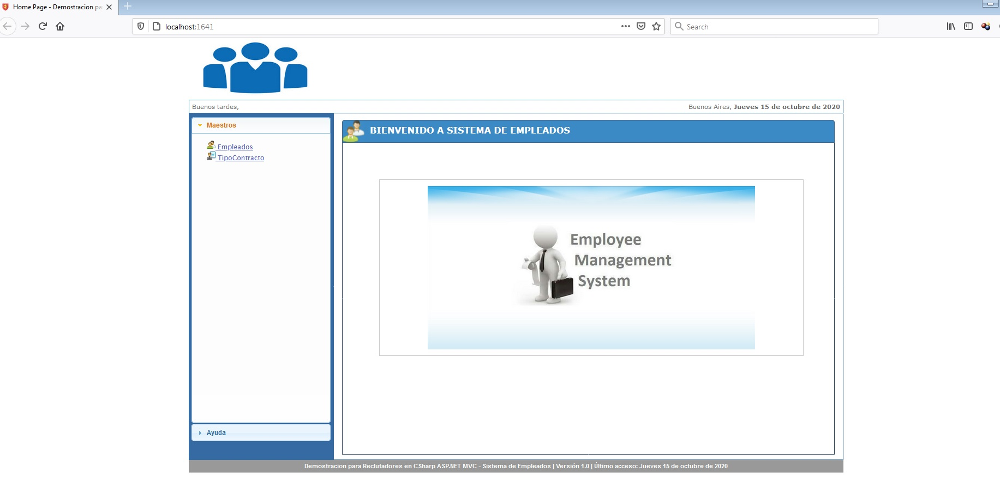

# Sistema-de-Gestion-de-Empleados
---------------------------------

Demostración en C# (ASP.Net MVC) para Reclutadores
--------------------------------------------------

Archivo Léeme de Sistema de Personas - (ASP.Net MVC)
----------------------------------------------------

Gracias por interesarte en mi perfil el siguiente software tiene como finalidad ofrecérselo al equipo técnico para su evaluación, en el pueden comprobar las diferentes funcionalidades que desarrolle.
Incluye todas las características de desarrollo que en mi opinión, debería tener un sistema y las prácticas de desarrollo que se usan en la industria del software.
Espero que sea de su agrado poder cubrir sus expectativas y poder encajar en su perfil profesional y que puedan encontrar en mi trabajo al profesional ideal con los conocimientos avanzados en el Desarrollo en C# (ASP.Net MVC).

Muchas gracias.

Ing. Adolfredo Nicolas Belizario Ojeda.

Nº de Colegio Ingeniero de Venezuela: 294.866

Cel: +58 426 9508247 / +58 426-9545053 / +54 911 2251-3156

Correo: adolfredobelizario87@hotmail.com / adolfredobelizario87@gmail.com

-----------------------
1. Configuración mínima
-----------------------

Procesador 	 			- Procesador Intel® Pentium® V MMX 3500 MHz

Memoria		 			- 3000 Mb RAM

Disco duro	 			- 1000 Mb de espacio libre en disco duro

Sistema operativo		- Windows® XP/7/8

Sistemas Adicionales 	- Visual Studio 2017 y SQL Server 2008

---------------------------------------
2. Información adicional
---------------------------------------

Sistema de Gestion de Empleados:

Sistema de Gestion de Empleados desarrollado en C# con SQL Server 2008: 

BD: Diagrama ER, Creación de Tablas, Creación de Store Procedure, Programacion SQL.

Metodología: Desarrollo en C# ASP.Net MVC (Modelo-Vista-Controlador).

Back-End: C# (ASP.Net MVC), Linq C#, Expresiones Lambda C#, .Net Entity Framework, Colecciones Lsit<Entidad>, Delegados, etc.

Front-End: HTML, CSS, JavaScript, JQuery, XML, JSON, etc. 

Software (c) 2020 Adolfredo Belizario. Este Software fue creado por Adolfredo Belizario bajo licencia MPL v2.0 con el propósito de mostrar mi trabajo a Reclutadores en Desarrollo en .Net y C#

-----------------------
3. Correr Sistema
-----------------------

Para ejecutar es necesario correr el script BD.sql que se encunetra en Empleados\Base de Datos\Scripts en el SQL Server 2008-2016 en el directorio Empleados\Base de Datos\BD se encuentra el mdf y el log de la BD.

Es necesario que modifiques el directorio a don de guardas tu BD.

Luego corres la soluccion de Visual Studio 2017 Empleados\Solucion\Empleados.sln espera que se cargen todos los paquetes NuGet y listo pulsa F5.

Luego debe de mostrarte una pantalla principal como la que vez abajo.

En el caso que quieras verificar los empleados concretamente debes de ir a la seccion de Empleados en el Menu Maestros, Inicialmente son cargados todos inicialmente, luego si quieres filtrar determinada opcion puedes usar el boton buscar que te abre una pantalla de asistente para busqueda avanzada en el cual puedes buscar por multiples parametros y cualquier campo en concreto.

Tambien puedes ver/modificar/eliminar un empleado en concreto pulsando los botones acciones

En el caso de que quieras editar o eliminar o ver puedes seleccionar el boton correspondiente.

Y tambien puedes modificar los multiplos de Sueldo de cada empleado para el calculo anual, ya que te brinda una opccion de editar y ver el maestro de tipos de contrato

